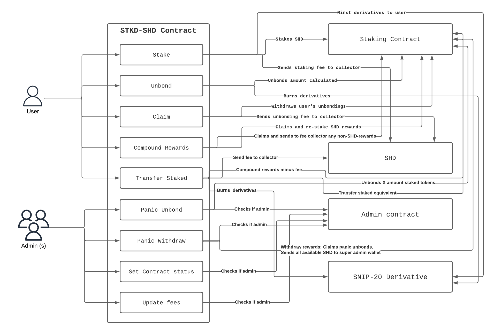

# Derivative minter contract

This contract enables users to send SHD (or any SNIP-20) and receive a staking derivative token that can later be sent to the contract to unbond the sent amount's value in SHD (SNIP-20).

## Index

#### [Engineering Design Diagram](#design)

#### [How to deploy](#deploy)

#### [Instantiation message](#init)

**Messages**

- [Stake](#Stake)
- [Unbond](#Unbond)
- [TransferStaked](#TransferStaked)
- [Claim](#Claim)
- [CompoundRewards](#CompoundRewards)
- [UpdateFees](#UpdateFees)
- [PanicUnbond](#PanicUnbond)
- [PanicWithdraw](#PanicWithdraw)
- [SetContractStatus](#SetContractStatus)

**Queries**

- [Holdings](#Holdings)
- [StakingInfo](#StakingInfo)
- [Unbondings](#Unbondings)
- [FeeInfo](#FeeInfo)
- [ContractStatus](#ContractStatus)

<a id="design"></a>

## Engineering Design Diagram



<a id="deploy"></a>

## How to deploy

### Requirements

- [SecretCLI installed and configured](https://docs.scrt.network/secret-network-documentation/development/tools-and-libraries/secret-cli)
- Account with funds (~6 scrt)
- Derivative (SNIP-20) deployed

#### Steps

1. Make sure you have the docker demon turned on.
2. Open project in a terminal.
3. Compile and optimized contract. In the root folder run this command:

```shell
make compile-optimized-reproducible
```

4. Store contract on chain.

```shell
secretcli tx compute store contract.wasm.gz --from <ACCOUNT_NAME> -y --gas 3000000 | jq
```

5. Query contract code id

```shell
CODE_ID=$(secretcli q compute list-code | jq '.[-1].code_id')
```

6. Instantiate a new contract

```shell
TX_HASH=$(secretcli tx compute instantiate ${CODE_ID} '<INIT_MSG>' --from <ACCOUNT_NAME> -y --gas 3000000 --label $(openssl rand -base64 12 | tr -d /=+ | cut -c -16) | jq '.txhash' | tr -d '"') && echo ${TX_HASH}
```

7. Query contract's address

```shell
ADDRESS=$(secretcli q compute tx ${TX_HASH} | jq '.output_logs[0].attributes[0].value' | tr -d '"') && echo ${ADDRESS}
```

8. Set staking derivative as minter of derivative
```shell
secretcli tx compute execute <DERIVATIVE_ADDR> '{"set_minters":{"minters":["'${ADDRESS}'"]}}' --from <ACCOUNT_NAME> -y | jq
```

9. Whitelist staking derivative in staking contract
```
secretcli tx compute execute <STAKING_ADDR> '{"add_transfer_whitelist":{"user":"'${ADDRESS}'"}}'
```

#### Troubleshooting

- Query transaction's status

```shell
secretcli q compute tx ${TX_HASH} | jq
```

<a id="init"></a>

## Init Message

```ts
import { Binary } from "cosmwasm-stargate";

interface ContractInfo {
  address: string;
  code_hash: string;
  entropy?: string | null;
}

interface Fee {
  collector: string;
  rate: number;
  decimal_places: number;
}

interface FeeInfo {
  staking: Fee;
  unbonding: Fee;
}

interface InstantiateMsg {
  prng_seed: Binary;
  staking: ContractInfo;
  query_auth: ContractInfo;
  derivative: ContractInfo;
  token: ContractInfo;
  admin: ContractInfo;
  fees: FeeInfo;
}
```

```json
{
  "prng_seed": "base64-encoded binary",
  "staking": {
    "address": "secret1abcdefghjklmnopqrstuvwxyz",
    "code_hash": "string",
    "entropy": "string or null"
  },
  "query_auth": {
    "address": "secret1abcdefghjklmnopqrstuvwxyz",
    "code_hash": "string",
    "entropy": "string or null"
  },
  "derivative": {
    "address": "secret1abcdefghjklmnopqrstuvwxyz",
    "code_hash": "string",
    "entropy": "string or null"
  },
  "token": {
    "address": "secret1abcdefghjklmnopqrstuvwxyz",
    "code_hash": "string",
    "entropy": "string or null"
  },
  "admin": {
    "address": "secret1abcdefghjklmnopqrstuvwxyz",
    "code_hash": "string",
    "entropy": "string or null"
  },
  "fees": {
    "staking": {
      "collector": "secret1abcdefghjklmnopqrstuvwxyz",
      "rate": 0,
      "decimal_places": 0
    },
    "unbonding": {
      "collector": "secret1abcdefghjklmnopqrstuvwxyz",
      "rate": 0,
      "decimal_places": 0
    }
  }
}
```

## Messages

### Stake

Calculates the equivalent amount of derivative per token sent.
Triggered by the receiver interface when sending SHD tokens.

🌐 Anyone can use this feature.

**Request**

```typescript
interface ExecuteSendMsg {
  recipient: string;
  amount: string;
  msg: string; // '{"stake":{}}' Base64 encoded
  padding?: string;
}

interface ExecuteStakeMsg {
  send: ExecuteSendMsg;
}
```

```json
{
  "send": {
    "recipient": "secret1b1b1b1bb1b1b1b1b1b1",
    "amount": "100000000",
    "msg": "eyJzdGFrZSI6e319",
    "padding": "random string"
  }
}
```

**Response**

```typescript
interface StakeResponse {
  shd_staked: string;
  tokens_returned: string;
}
interface StakeMsgResponse {
  stake: StakeResponse;
}
```

```json
{
  "stake": {
    "shd_staked": "50000000",
    "tokens_returned": "50000000"
  }
}
```

**Errors**

| Message                                                                                               | Cause                                                                             | How to solve it                           |
| ----------------------------------------------------------------------------------------------------- | --------------------------------------------------------------------------------- | ----------------------------------------- |
| Sender is not SHD contract                                                                            | The token sent is not the same as indicated at contract's instantiation           | Send the appropriate token                |
| No SHD was sent for staking                                                                           | You send 0 tokens to the contract (if that's possible)                            | Send more than 0                          |
| The amount of SHD deposited is not enough to receive any of the derivative token at the current price | The price is high causing that the amount sent is not enough to buy 1 derivative. | Send more SHD to the contract than before |

### Unbond

Calculates the equivalent amount of SHD per derivative sent.
Triggered by Receiver interface when sending derivative tokens.

🌐 Anyone can use this feature.

**Request**

```typescript
interface ExecuteSendMsg {
  recipient: string;
  amount: string;
  msg: string; // '{"unbond":{}}' Base64 encoded
  padding?: string;
}

interface ExecuteUnbondMsg {
  send: ExecuteSendMsg;
}
```

```json
{
  "send": {
    "recipient": "secret1b1b1b1bb1b1b1b1b1b1",
    "amount": "100000000",
    "msg": "eyJ1bmJvbmQiOnt9fQ==",
    "padding": "random string"
  }
}
```

**Response**

```typescript
interface UnbondResponse {
  tokens_redeemed: string;
  shd_to_be_received: string;
  estimated_time_of_maturity: string;
}
interface UnbondMsgResponse {
  unbond: UnbondResponse;
}
```

```json
{
  "unbond": {
    "tokens_redeemed": "50000000",
    "shd_to_be_received": "50000000",
    "estimated_time_of_maturity": "50000000"
  }
}
```

**Errors**

| Message                                                    | Cause                                                                      | How to solve it                                   |
| ---------------------------------------------------------- | -------------------------------------------------------------------------- | ------------------------------------------------- |
| Sender is not derivative (SNIP20) contract                 | The token sent is not the same as indicated at contract's instantiation    | Send the appropriate tokens                       |
| 0 amount sent to unbond                                    | You send 0 tokens to the contract (if that's possible)                     | Send more than 0                                  |
| Redeeming derivative tokens would be worth less than 1 SHD | The price is high causing that the amount sent is not enough to buy 1 SHD. | Send more derivatives to the contract than before |

### TransferStaked

Calculates the equivalent amount of SHD per derivative sent. Then sends this SHD as staked position to the sender.
Triggered by Receiver interface when sending derivative tokens.

🌐 Anyone can use this feature.

**Request**

```typescript
interface ExecuteSendMsg {
  recipient: string;
  amount: string;
  msg: string; // '{"transfer_staked":{"receiver":"opt_receiver_address"}}' Base64 encoded
  padding?: string;
}

interface ExecuteUnbondMsg {
  send: ExecuteSendMsg;
}
```

```json
{
  "send": {
    "recipient": "secret1b1b1b1bb1b1b1b1b1b1",
    "amount": "100000000",
    "msg": "eyJ0cmFuc2Zlcl9zdGFrZWQiOnsicmVjZWl2ZXIiOiJzZWNyZXQxcjZ5OXBxdXkwc3l4a2tndXJodXBnN2tzY3NuMDd6Mmo3ZGo3NyJ9fQ==",
    "padding": "random string"
  }
}
```

**Response**

```typescript
interface TransferStakedResponse {
  tokens_returned: string;
  amount_sent: string;
}
interface TransferStakedMsgResponse {
  transfer_staked: TransferStakedResponse;
}
```

```json
{
  "transfer_staked": {
    "amount_sent": "50000000",
    "tokens_returned": "50000000"
  }
}
```

**Errors**

| Message                                                    | Cause                                                                      | How to solve it                                   |
| ---------------------------------------------------------- | -------------------------------------------------------------------------- | ------------------------------------------------- |
| Sender is not derivative (SNIP20) contract                 | The token sent is not the same as indicated at contract's instantiation    | Send the appropriate tokens                       |
| 0 amount sent to unbond                                    | You send 0 tokens to the contract (if that's possible)                     | Send more than 0                                  |
| Redeeming derivative tokens would be worth less than 1 SHD | The price is high causing that the amount sent is not enough to buy 1 SHD. | Send more derivatives to the contract than before |

### Claim

This message claims user's mature unbondings in case there is any.

🌐 Anyone can use this feature.

**Request**

```typescript
interface ExecuteClaimMsg {
  claim: {};
}
```

```json
{
  "claim": {}
}
```

**Response**

```typescript
interface ClaimMsgResponse {
  claim: {
    amount_claimed: string;
  };
}
```

```json
{
  "claim": {
    "amount_claimed": "200000000"
  }
}
```

**Errors**

| Message                       | Cause                                                                           | How to solve it                                                        |
| ----------------------------- | ------------------------------------------------------------------------------- | ---------------------------------------------------------------------- |
| No mature unbondings to claim | None of your unbondings in progress are matured or you haven't unbonded any SHD | Query your unbondings to see when they will matured or unbond some SHD |

### CompoundRewards

Claims SHD rewards generated and re-stake them. Claims non-SHD rewards and sends them to fee's collector.

🌐 Anyone can use this feature.

**Request**

```typescript
interface ExecuteCompoundRewardsMsg {
  compound_rewards: {};
}
```

```json
{
  "compound_rewards": {}
}
```

**Response**

```typescript
import ResponseStatus from "shade-protocol";

interface CompoundRewardsMsgResponse {
  compound_rewards: {
    status: ResponseStatus;
  };
}
```

```json
{
  "compound_rewards": {
    "status": "success"
  }
}
```

**Errors**

There are no errors triggered by this contract but the `staking contract`.

### UpdateFees

Updates fee's collector, percentage or decimal places.

👥 Only admin(s) can use this feature.

**Request**

```typescript
interface Fee {
  rate: number;
  decimal_places: number;
}

interface UpdateFeesMsg {
  staking?: Fee;
  unbonding?: Fee;
  collector?: string;
}

interface ExecuteUpdateFeesMsg {
  update_fees: UpdateFeesMsg;
}
```

```json
{
  "update_fees": {
    "collector": "secretb1b1b1b1b1b1b1b1b1b1b1b1",
    "staking": {
      "rate": 50000,
      "decimal_places": 5
    },
    "unbonding": {
      "rate": 50000,
      "decimal_places": 5
    }
  }
}
```

**Response**

```typescript
import ResponseStatus from "shade-protocol";

interface Fee {
  rate: number;
  decimal_places: number;
}

interface FeeInfo {
  staking: Fee;
  unbonding: Fee;
  collector: string;
}

interface UpdateFeesMsgResponse {
  update_fees: {
    status: ResponseStatus;
    fee: FeeInfo;
  };
}
```

```json
{
  "update_fees": {
    "status": "success",
    "fee": {
      "collector": "secretb1b1b1b1b1b1b1b1b1b1b1b1",
      "staking": {
        "rate": 50000,
        "decimal_places": 5
      },
      "unbonding": {
        "rate": 50000,
        "decimal_places": 5
      }
    }
  }
}
```

**Errors**

| Message                                                                                                                                                | Cause                                 | How to solve it                              |
| ------------------------------------------------------------------------------------------------------------------------------------------------------ | ------------------------------------- | -------------------------------------------- |
| [Unauthorize admin](https://github.com/securesecrets/shade/blob/basic-staking/packages/shade_protocol/src/contract_interfaces/admin/errors.rs#L51-L56) | Sender is not part of the admins list | Use an admin account to perform this action. |

### PanicUnbond

Unbonds X amount staked from staking contract.

👥 Only admin(s) can use this feature.

**Request**

```typescript
interface ExecutePanicUnbondMsg {
  panic_unbond: {
    amount: string;
  };
}
```

```json
{
  "panic_unbond": {
    "amount": "100000000"
  }
}
```

**Response**

_Default response_

**Errors**

| Message                                                                                                                                                | Cause                                 | How to solve it                              |
| ------------------------------------------------------------------------------------------------------------------------------------------------------ | ------------------------------------- | -------------------------------------------- |
| [Unauthorize admin](https://github.com/securesecrets/shade/blob/basic-staking/packages/shade_protocol/src/contract_interfaces/admin/errors.rs#L51-L56) | Sender is not part of the admins list | Use an admin account to perform this action. |

### PanicWithdraw

Withdraws all rewards, matured unbondings and SHD balance.
This funds will be sent to `super admin`.

👥 Only admin(s) can use this feature.

**Request**

```typescript
interface ExecutePanicWithdrawMsg {
  panic_withdraw: {};
}
```

```json
{
  "panic_withdraw": {}
}
```

**Response**

_Default response_

**Errors**

| Message                                                                                                                                                | Cause                                 | How to solve it                              |
| ------------------------------------------------------------------------------------------------------------------------------------------------------ | ------------------------------------- | -------------------------------------------- |
| [Unauthorize admin](https://github.com/securesecrets/shade/blob/basic-staking/packages/shade_protocol/src/contract_interfaces/admin/errors.rs#L51-L56) | Sender is not part of the admins list | Use an admin account to perform this action. |

### SetContractStatus

Sets contract status.

👥 Only admin(s) can use this feature.

**Request**

```typescript
enum ContractStatusLevel {
  NormalRun,
  Panicked
  StopAll,
}

interface ExecuteSetContractStatusMsg {
  set_contract_status: {
    level: ContractStatusLevel;
    padding?: string;
  };
}
```

```json
{
  "set_contract_status": {
    "level": "stop_all",
    "padding": "random string"
  }
}
```

**Response**

```typescript
import ResponseStatus from "shade-protocol";

interface ContractStatusMsgResponse {
  set_contract_status: {
    status: ResponseStatus;
  };
}
```

```json
{
  "set_contract_status": {
    "status": "success"
  }
}
```

**Errors**

| Message                                                                                                                                                | Cause                                 | How to solve it                              |
| ------------------------------------------------------------------------------------------------------------------------------------------------------ | ------------------------------------- | -------------------------------------------- |
| [Unauthorize admin](https://github.com/securesecrets/shade/blob/basic-staking/packages/shade_protocol/src/contract_interfaces/admin/errors.rs#L51-L56) | Sender is not part of the admins list | Use an admin account to perform this action. |

## Queries

### Holdings

Queries user's claimable total amount and unbonding total amount.

**Request**

```typescript
interface HoldingsQuery {
  holdings: {
    address: string;
    viewing_key: string;
  };
}
```

```json
{
  "holdings": {
    "address": "secret1b1b1b1b1b1b1b1b1",
    "viewing_key": "password"
  }
}
```

**Response**

```typescript
interface HoldingsQueryResponse {
  holdings: {
    derivative_claimable: string;
    derivative_unbonding: string;
  };
}
```

```json
{
  "holdings": {
    "derivative_claimable": "100000000",
    "derivative_unbonding": "200000000"
  }
}
```

### StakingInfo

Queries contract's balances and price information.

**Request**

```typescript
interface StakingInfoQuery {
  staking_info: {};
}
```

```json
{
  "staking_info": {}
}
```

**Response**

```typescript
interface StakingInfoQueryResponse {
  staking_info: {
    unbonding_time: string;
    bonded_shd: string;
    available_shd: string;
    rewards: string;
    total_derivative_token_supply: string;
    price: string;
  };
}
```

```json
{
  "staking_info": {
    "unbonding_time": "36000",
    "bonded_shd": "100000000",
    "available_shd": "0",
    "rewards": "320400",
    "total_derivative_token_supply": "100000000",
    "price": "102000000"
  }
}
```

### Unbondings

Queries user's unbondings in progress.

**Request**

```typescript
interface UnbondingsQuery {
  unbondings: {
    address: string;
    viewing_key: string;
  };
}
```

```json
{
  "unbondings": {
    "address": "secret1b1b1b1b1b1b1b1b1",
    "viewing_key": "password"
  }
}
```

**Response**

```typescript
import Unbonding from "shade-protocol";
interface UnbondingsQueryResponse {
  unbondings: {
    unbonds: Unbonding[];
  };
}
```

```json
{
  "unbondings": {
    "unbonds": [
      {
        "id": "1",
        "amount": "400000000",
        "complete": "39478094578404"
      }
    ]
  }
}
```

### FeeInfo

Queries staking and unbonding fees configuration.

**Request**

```typescript
interface FeeInfoQuery {
  fee_info: {};
}
```

```json
{
  "fee_info": {}
}
```

**Response**

```typescript
interface Fee {
  rate: number;
  decimal_places: number;
}

interface FeeInfoQueryResponse {
  fee_info: {
    collector: string;
    staking: Fee;
    unbonding: Fee;
  };
}
```

```json
{
  "fee_info": {
    "collector": "secret1b1b1b1b1b1b1b1b1",
    "staking": {
      "rate": 100,
      "decimal_places": 3
    },
    "unbonding": {
      "rate": 100,
      "decimal_places": 3
    }
  }
}
```

### ContractStatus

Queries contracts status.

**Request**

```typescript
interface ContractStatusQuery {
  contract_status: {};
}
```

```json
{
  "contract_status": {}
}
```

**Response**

```typescript
interface ContractStatusLevel {
  NormalRun;
  StopAll;
}

interface ContractStatusQueryResponse {
  contract_status: {
    status: ContractStatusLevel;
  };
}
```

```json
{
  "contract_status": {
    "status": "stop_all"
  }
}
```
